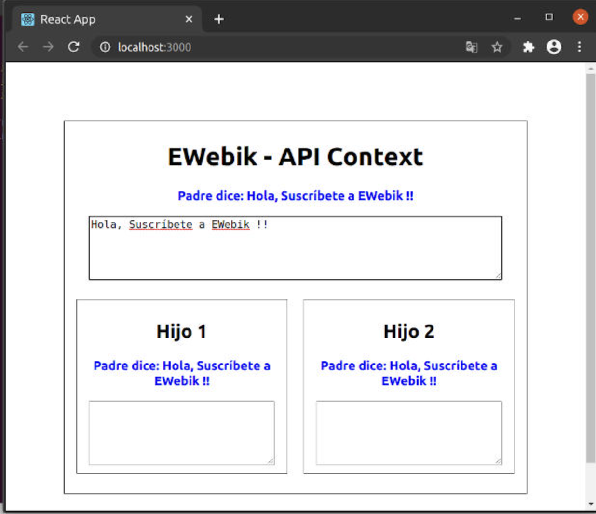

# APIContext
-   Verás como comunicar componentes de padre a hijo, y de hermano a hermano, es una estructura común y que tendremos seguro en nuestros proyecto, si o si.
-   Identificar de que componente viene un dato.
-   Como se propaga la información entre tus componentes.
-   Veremos en acción las tools de React.

>**Context es una forma de comunicación del árbol de componentes en React**, ya que, nos evita pasar propiedades (props) de forma manual por cada nivel de componentes que tenga nuestro árbol.

Recordemos que por lo regular **en una aplicación hecha en React los datos se propagan de los componentes padres a los hijos a través de las pops**.

Si bien, podemos hacer aplicaciones grandes utilizando este método de propagación de datos, llegará el momento en que el código se volverá muy complicado de leer y sobre todo de mantener, ya que, esta propagación se realiza por cada nivel.

El funcionamiento de Context permite realizar una propagación de datos entre componentes sin que de forma explicita tengamos que asignar propiedades a los componentes por cada nivel.

Lo anterior nos permite crear aplicaciones escalables, sin alterar el hecho de que la información fluye de componentes padres a hijos.

## Usar Context

-   Comunicar una gran cantidad de componentes.
-   Comunicar componentes hermanos.
-   Si existen componentes intermedios que no requieren hacer uso implícito de propiedades.

## Ventajas

-   Puedes comunicar una gran cantidad de componentes que se encuentran en diferentes niveles.
-   Aislamiento de componentes.
-   Código mas legible.
-   Concentración de actualización de datos

## Desventajas

-   Utilizar Context puede limitar la reutilización de componentes.

Bien, la **API Context**, provee un método que nos permite utilizar ciertos componentes que nos ayudan a la propagación de información.

Con **React.createContext** creamos un objeto que nos permite definir un:

-   Provider
-   y un Consumer

### Context.Provider

Cuando definimos Context, este viene con un componente **Provider**, y todo componente que se suscriba a el, podrá acceder a su contexto.

Características:
-   Acepta una propiedad de nombre value, la cual sera propagada a todos los componentes consumidores o suscritos a el.
-   Puede o no estar conectado a muchos componentes denominados consumidores.
-   Puede existir anidación, con la intención de sobreescribir valores de los niveles más bajos del árbol de componentes.
-   Los componentes suscritos son capaces de detectar cuando hay un cambio en el contexto y actualizan la DOM.

### Context.Consumer

Es un componente de React que se suscribe a un componente **Provider** con la intención de detectar cambios dentro de sus contexto.

Características: 
-   Requiere de una función como hijo principal.
-   Dicha función es capaz de recibir el valor del contexto actual, y retorna un elemento, o mejor dicho, un nodo de React.
-   El valor recibido es igual a la propiedad **value** del **Provider** al que este suscrito, es decir, el mas cercano, ya que recuerda que React soporta anidación de **Provider**.

## Declaración de Context

Podemos declarar un Context a través de:

```js
const Context = React.createContext(objDefault);
```

**createContext**, es capaz de recibir un valor por default, el cual será asignado a los consumidores cuando en el **Provider** no exista un contexto.

Y por destructuración podemos, obtener directamente el **Provider** y el **Consumer**.

```js
const {Provider, Consumer} = React.createContext();
```

---------------------------------------------------------------------------
## Ejemplo:

Vamos a crear un pequeño chat donde todos los componentes se van a enterar de lo que dicen los otros, es decir:

-   Cada componente tendrá un **input textarea** que permitirá introducir texto y lo propagaremos a cada uno de los componentes del árbol, tanto padres como hijos.
-   En cada componente mostraremos el texto que se introduce y distinguiremos, a través, del cambio de color y texto, indicando de que componente se escribió dicho texto o mensaje.

 

Como puedes ver en la imagen cuando escribes algo en algún componente, todos los componentes dentro del árbol se enteran, es decir, los datos se propagan tal y como indica React.

Bien, veamos como desarrollar la aplicación propuesta:

1.  Lo primero que tenemos que hacer es declarar nuestro provider.

```js
//DECLARACIÓN
const {Provider, Consumer} = React.createContext();
```

2.  Ahora tenemos que envolver con nuestro componente **Provider**, el árbol de componentes que deseamos comunicar.

```jsx
class Padre extends React.Component{
  constructor(props){
    super(props)
    this.state={
      mensaje:"",
      index:0
    }
  }

  actualizarMensaje = (e, index)=>{
    const {value} = e.target;
    this.setState({
      ...this.state,
      mensaje:value,
      index
    })
  }

  render(){
    return(
      <Provider value={{
        mensaje: this.state.mensaje,
        index: this.state.index,
        actualizarMensaje:this.actualizarMensaje
      }}>
        <div className="padre">
          <h1>EWebik - API Context</h1>
          {
            this.state.mensaje !== "" ?(
              <p className={
                this.state.index === 0 ? 'colorPadre':
                this.state.index === 1 ? 'colorHijo1':
                this.state.index === 2 ? 'colorHijo2':''
              }>{
                ((this.state.index === 0 ? 'Padre dice:':
                  this.state.index === 1 ? 'Hijo 1 dice:':
                  this.state.index === 2 ? 'Hijo 2 dice:':'')
                  + ' ' + this.state.mensaje)
              }</p>
            ):("")
          }
          <textarea
            rows="5"
            onChange={(e)=>{
              this.actualizarMensaje(e,0);
            }} />
          <div className="hijos">
            <Hijo1 />
            <Hijo2 />
          </div>
        </div>
      </Provider>
    )
  }
}
```


3.  Definimos el objeto o valor de la propiedad **value** del **Provider**, que en este ejemplo lo declaramos como un **JSON**.

```javascript
{
        mensaje: this.state.mensaje,
        index: this.state.index,
        actualizarMensaje:this.actualizarMensaje
}
```

4.  Declarando nuestros componentes consumidores o **Consumer**. En este ejemplo necesitamos dos Hijo 1 e Hijo 2.

```jsx
const Hijo1 = (props)=>{
  return(
    <Consumer>
      {
        ({mensaje, index, actualizarMensaje}) =>(
          <div className="hijo">
            <h2>Hijo 1</h2>
            {
              mensaje !== "" ?(
                <p className={
                  index === 0 ? 'colorPadre':
                  index === 1 ? 'colorHijo1':
                  index === 2 ? 'colorHijo2':''
                }>{
                  ((index === 0 ? 'Padre dice:':
                    index === 1 ? 'Hijo 1 dice:':
                    index === 2 ? 'Hijo 2 dice:':'')
                    + ' ' + mensaje)
                }</p>
              ):("")
            }
            <textarea
              rows="5"
              onChange={(e)=>{
                actualizarMensaje(e,1);
              }} />
          </div>
        )
      }
    </Consumer>
  )
}
```

```jsx
const Hijo2 = (props)=>{
  return(
    <Consumer>
    {
      ({mensaje, index, actualizarMensaje}) =>(
        <div className="hijo">
          <h2>Hijo 2</h2>
          {
            mensaje !== "" ?(
              <p className={
                index === 0 ? 'colorPadre':
                index === 1 ? 'colorHijo1':
                index === 2 ? 'colorHijo2':''
              }>{
                ((index === 0 ? 'Padre dice:':
                  index === 1 ? 'Hijo 1 dice:':
                  index === 2 ? 'Hijo 2 dice:':'')
                  + ' ' + mensaje)
              }</p>
            ):("")
          }
          <textarea
            rows="5"
            onChange={(e)=>{
              actualizarMensaje(e,2);
            }} />
        </div>
      )
    }
    </Consumer>
  )
}
```

5.  Bien, en este punto ya debería funcionar tu aplicación, solo recuerda que los consumidores requieren de una función que recibe el valor del contexto del Provider más cercano, en este caso solo tenemos uno, pero igual aplica. Para este ejemplo recibe los datos: **mensaje, index y actualizarMensaje**.

```jsx
<Consumer>
    {
      ({mensaje, index, actualizarMensaje}) =>(
        ...
      )
    }
</Consumer>
```

6.  Excelente, en este punto me gustaría resaltar el uso de **actualizarMensaje:**
    -   este método se declara en el componente Padre y se propaga a través del contexto a todos los hijos
    -   Esto es útil, ya que todos los hijos pueden ejecutar este método, que actualizará el state del padre
    -   Con lo cual, actualizara la propiedad **value** del **Provider**, modificando el contexto recibido en cada consumidor, permitiendo que estos actualicen la DOM.

```

actualizarMensaje = (e, index)=>{
    const {value} = e.target;
    this.setState({
      ...this.state,
      mensaje:value,
      index
    })
  }
  ```


## Código CSS de los componentes

```css
.padre{
  position: relative;
  text-align: center;
  border: 1px solid #111;
  padding: 5px;
}

.hijos{
  margin: 20px 0px;
  display: flex;
  justify-content: space-around;
  align-items: center;
}

.hijo{
  text-align: center;
  border: 1px solid #111;
  padding: 5px;
  margin: 0px 10px;
  width: 90%;
}

.padre textarea,
.hijo textarea{
  width: 90%;
}

.colorPadre{
  color: blue;
  font-weight: bold;
}

.colorHijo1{
  color: red;
  font-weight: bold;
}

.colorHijo2{
  color: green;
  font-weight: bold;
}
```
